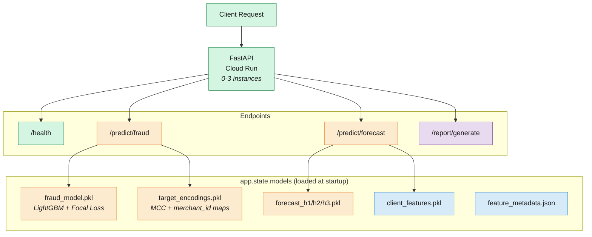

# API Serving Layer

FastAPI on Cloud Run with real-time fraud predictions, expense forecasts, and AI-generated reports.

## Why This Layer Exists

A model in a `.pkl` file isn't useful to anyone. The serving layer turns trained models into a REST API that other systems can call: a payment processor sends a transaction, the API returns a fraud score in milliseconds. The same API serves expense forecasts and generates financial reports via an AI agent.

This document covers the app-level architecture (how FastAPI is structured, how models are loaded, how routing works) and the deployment setup (Docker, Cloud Run, health checks). For the per-endpoint request flows and model-specific details, see the [fraud detection](3-ml-fraud-detection.md#serving-via-fastapi) and [expense forecast](4-ml-expense-forecast.md#serving-via-fastapi) guides.

## Architecture



## Application Structure

The FastAPI app is split across 7 files following a clean separation of concerns:

| File | Purpose |
|------|---------|
| [`app/main.py`](../app/main.py) | App initialization, lifespan, CORS middleware, router registration |
| [`app/model_loader.py`](../app/model_loader.py) | Loads all pkl/json artifacts at startup, handles missing files gracefully |
| [`app/schemas.py`](../app/schemas.py) | Pydantic request/response models with field validation |
| [`app/routers/health.py`](../app/routers/health.py) | `/health` endpoint (used by Cloud Run probes) |
| [`app/routers/fraud.py`](../app/routers/fraud.py) | `/predict/fraud` (see [fraud detection doc](3-ml-fraud-detection.md#serving-via-fastapi)) |
| [`app/routers/forecast.py`](../app/routers/forecast.py) | `/predict/forecast` (see [expense forecast doc](4-ml-expense-forecast.md#serving-via-fastapi)) |
| [`app/routers/agent.py`](../app/routers/agent.py) | `/report/generate` (AI agent for financial reports) |

## Key Design Patterns

### Lifespan model loading

Models are loaded **once at startup**, not on every request. FastAPI's `lifespan` context manager handles this:

```python
@asynccontextmanager
async def lifespan(app: FastAPI):
    models = load_models()
    app.state.models = models
    yield
```

`load_models()` scans `outputs/models/` and deserializes every `.pkl` file into a dict stored in `app.state.models`. Each router accesses models via `request.app.state.models`. No global variables, no singletons.

The loader is defensive: if a model file is missing or corrupted, the app starts anyway with whatever artifacts it can find. The `/health` endpoint reports how many models were loaded, and individual endpoints return 503 if their model is unavailable.

### Pydantic request validation

Every endpoint has a typed request/response schema. For example, the fraud endpoint validates:

```python
class FraudRequest(BaseModel):
    transaction_id: str
    amount: float
    use_chip: str
    mcc: int
    merchant_id: int
    is_online: int = Field(ge=0, le=1)
    has_bad_cvv: int = Field(ge=0, le=1, default=0)
    txn_hour: int = Field(ge=0, le=23)
    credit_limit: float = 0.0
    # ...
```

Invalid requests (negative hour, is_online=5, missing required fields) are rejected with a 422 before any model code runs. This means the model never sees malformed input.

### Router organization

Endpoints are grouped by domain using FastAPI routers:

```python
app.include_router(health.router)
app.include_router(fraud.router, prefix="/predict", tags=["predictions"])
app.include_router(forecast.router, prefix="/predict", tags=["predictions"])
app.include_router(agent.router, prefix="/report", tags=["agent"])
```

The `prefix` argument keeps endpoint paths clean: the fraud router defines `/fraud`, but it's mounted at `/predict/fraud`. The `tags` argument groups endpoints in the auto-generated Swagger docs at `/docs`.

## Endpoints

### `/health`

Returns the app status and number of loaded models. Used by Cloud Run startup and liveness probes to determine if the container is ready for traffic.

### `/predict/fraud`

Accepts a transaction's features, computes derived features, applies target encoding, runs LightGBM prediction with sigmoid correction, and returns a fraud probability with a binary decision. Full request flow documented in the [fraud detection guide](3-ml-fraud-detection.md#how-a-request-flows).

### `/predict/forecast`

Accepts a `client_id`, looks up pre-computed features, runs three horizon models (h=1, h=2, h=3), and returns monthly expense predictions clamped to zero. Full request flow documented in the [expense forecast guide](4-ml-expense-forecast.md#how-a-request-flows).

### `/report/generate`

AI-powered financial report generation with a 3-layer LLM strategy:

1. **Vertex AI Gemini** (scaffold, inactive by default): production-grade but incurs API costs. Configured but not active to avoid charges on a portfolio project.
2. **Ollama** (local): runs any open-source model locally for development. Useful for testing prompt engineering without cloud costs.
3. **Regex fallback** (default): deterministic date extraction from natural language prompts like "Create a report for the fourth month of 2017". Handles ordinal months, ISO date ranges, month names, and quarters.

The active backend is controlled by the `AGENT_LLM_BACKEND` environment variable (set to `regex` in the Cloud Run Terraform config). The regex fallback passes all 3 tests without any LLM dependency, making CI/CD reliable.

## Deployment

### Docker

```dockerfile
FROM python:3.10-slim
WORKDIR /app
COPY requirements.txt .
RUN pip install --no-cache-dir -r requirements.txt
COPY src/ src/
COPY app/ app/
COPY outputs/models/ outputs/models/
EXPOSE 8080
CMD ["uvicorn", "app.main:app", "--host", "0.0.0.0", "--port", "8080"]
```

Model artifacts are baked into the Docker image at build time. This means model updates require a new image build and deploy. In production, you'd decouple this by loading models from a registry (Vertex AI, MLflow) or a GCS bucket at startup.

### Cloud Run

Deployed via Terraform ([`terraform/modules/cloud_run/`](../terraform/modules/cloud_run/)):

| Setting | Value | Why |
|---------|-------|-----|
| **CPU** | 2 | LightGBM prediction + pandas DataFrame construction |
| **Memory** | 2Gi | Model deserialization + feature metadata in memory |
| **Min instances** | 0 | Scale to zero when idle (no cost when not in use) |
| **Max instances** | 3 | Portfolio project, not production scale |
| **Startup probe** | `/health`, 5s delay | Waits for model loading before accepting traffic |
| **Liveness probe** | `/health`, 30s period | Restarts container if health check fails |
| **Access** | Public (`allUsers`) | Portfolio project, no auth required |

The service account is `cloud-run-sa` with `bigquery.dataViewer` + `bigquery.jobUser` (for potential BigQuery queries from the agent endpoint) + `aiplatform.user` (Vertex AI scaffold).

### CI/CD

The [`docker-build-deploy.yml`](../.github/workflows/docker-build-deploy.yml) workflow triggers on pushes to main that touch `app/`, `src/`, `outputs/`, `Dockerfile`, or `requirements.txt`. It builds the image, pushes to Artifact Registry, and deploys to Cloud Run via Workload Identity Federation (no service account keys). The `production` GitHub Environment requires manual approval before deploy.

## API Reference

```bash
# Health check
curl http://localhost:8080/health

# Fraud prediction
curl -X POST http://localhost:8080/predict/fraud \
  -H "Content-Type: application/json" \
  -d '{"transaction_id": "123", "amount": -150.0, "use_chip": "Online Transaction",
       "mcc": 5411, "merchant_id": 100, "is_online": 1, "txn_hour": 3,
       "credit_limit": 5000}'

# Expense forecast
curl -X POST http://localhost:8080/predict/forecast \
  -H "Content-Type: application/json" \
  -d '{"client_id": 0}'

# Report generation
curl -X POST http://localhost:8080/report/generate \
  -H "Content-Type: application/json" \
  -d '{"client_id": 0, "prompt": "Create a report for the fourth month of 2017"}'
```

The FastAPI auto-generated docs at `/docs` provide interactive API exploration with request/response schemas and a "Try it out" button for each endpoint.

## Running Locally

```bash
# With uvicorn (hot reload)
make serve          # http://localhost:8080/docs

# With Docker
make docker-build
make docker-run     # http://localhost:8080/docs

# With docker-compose
make docker-compose-up
make docker-compose-down
```
